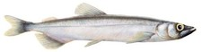

# Capelin maturity staging {#app:cap_mat}

(ref:capt-female) Female capelin (©Jón Baldur Hlíðberg). 

```{r female, fig.cap='(ref:capt-female)',echo=FALSE}
knitr::include_graphics(c("img/female.jpg", "img/male.jpg"))
```

(ref:capt-male) Male capelin (©Jón Baldur Hlíðberg). 

```{r male, fig.cap='(ref:capt-male)',echo=FALSE}

```

| Gonad maturity stage (numeric) | Name of maturity stage | Females | Males |
|---------------|---------------|------------------------------|------------------------------|
| 1 | __Immature a__ | Juvenile fish. Gonads tubular, very thin (<1 mm), translucent, and without colour. Can be difficult to detect for inexperienced researcher. The sex is difficult to determine at this stage. | Juvenile fish. Gonads tubular, thin (<1 mm), translucent, and without colour. Can be difficult to detect for inexperienced researcher. The sex is difficult to determine at this stage. |
| 2 | __Immature b__ | Ovaries thicker (more volume), transparent and without colour or with a hint of colour. Visible 'ripples' under the ovarian wall when the ovary is stretched. Relatively easy to determine sex. | Testes thicker (more volume), transparent and without colour or with a hint of colour. Testes are smooth when stretched, _i.e._ no 'ripples' visible. Relatively easy to determine sex. |
| 3 | __Mature - ripening a__ | Ovaries bigger and occupy up to half the body cavity. Opaque with visible yellow-white specks (eggs). Blood vessels visible.  Season in Iceland: October to December. | Testes opaque white or with white dots, firm and still of limited volume. Blood vessels visible. Season in Iceland: October to December. |
| 4 | __Mature - ripening b__ | Ovaries bigger (more volume), colour yellow or white, and occupy up to 2/3 of the body cavity (related to somatic body conditions of the individual). Eggs (oocytes) distinct and grainy. Eggs, in the front end of the ovaries, becoming hydrated (turning transparent). Blood vessels visible. Season in Iceland: middle of December to January. | Testes bigger (more volume), colour light grey or white, and milt has high viscosity (thick liquid). Blood vessels visible. Season in Iceland: middle of December to January. |
| 5 | __Mature - ripening c__ | Ovaries filling the body cavity. Majority of eggs hydrated (transparent). Ovaries do NOT run under pressure. Season in Iceland: latter part of January and February. | Testes grey or white. Milt has less viscosity (more runny liquid compared to stage 4). Milt does NOT run under pressure. Season in Iceland: latter part of January and February. |
| 6 | __Spawning__ | Ovaries run when light pressure is applied to abdomen. Eggs are hydrated (transparent). Season in Iceland: February--March. | Testes run when light pressure is applied to abdomen. Season in Iceland: Febryary--March. |
| 7 | __Spent__ | Ovaries slack with residual eggs. Season in Iceland: March. | Testes baggy, blodshot with residual milt. Season in Iceland: March. |
| 8 | __Resting__ | Ovaries small, no eggs visible. Difficult to determine if stage is 8 or 2 or 3. | Testes small, no milt visible. Difficult to determine if stage is 8 or 2 or 3. |

