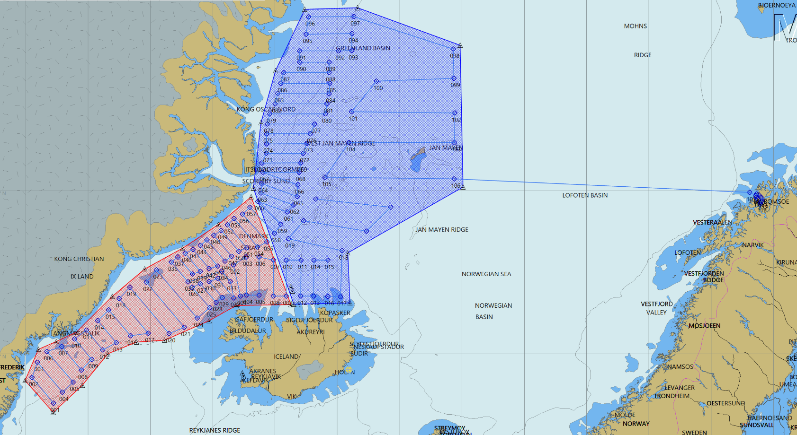

# Aim of survey

The main purpose of the survey is acoustic estimation of stock size
and distribution of mature and immature capelin, age groups 1 and
older in Iceland, East Greenland and Jan Mayen waters. In parallel it
is endeavoured to utilize the survey to gain further information on
capelin biology and ecosystem couplings/linkages to the physical
environment and biological communities in the area.

```{r,echo=FALSE}
knitr::include_graphics(rep("img/knit-logo.png", 3))
```

```{r,echo=FALSE}
knitr::include_graphics(rep("img/female.jpg", 3))
```

```{r,echo=FALSE}
knitr::include_graphics(rep("img/male.jpg", 3))
```

# Survey summary

The survey area extends along the East Greenland shelf break from 63°N
to 73°30'N, over the Denmark Strait and along the shelf break north of
the Westfjords peninsula and North Iceland, east to the 16°W
meridian. Figure \@ref(fig:track) sjows draft survey transects, but
note they are likely to changes as the weather, drift ice and the
distribution of the capelin have to be taken into account during the
execution of the survey. According to this plan total sailed distance,
both on transects and steaming, will be approx. 7800 nmi. Árni
Friðriksson will take part for 22 days, Bjarni Sæmundsson for 19.

```{r track, fig.cap="Planned tracks"}

```
